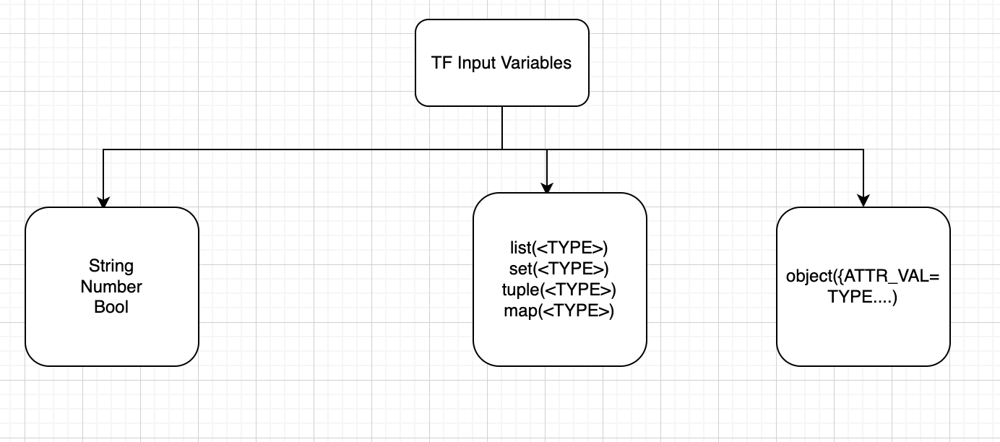

# Input, Output, Local Variables and data sources

Different type of input variables



## Project Layout

main.tf
inputs.tf
outputs.tf
providers.tf

## Declaring input variables 

```
variable image_id {
    type="string"
    description="The id of the machine image to use for the server."
}

variable "user_information" {
  type = object({
    name    = string
    address = string
  })
  sensitive = true
}

```

## Assigning input values to command line 

```
terraform apply -var="image_id=ami-abc123"
```

## variable definition files of tfvars
Files named exactly terraform.tfvars or terraform.tfvars.json

terraform apply -var-file="testing.tfvars"

Example file of tfvars is:
```
image_id = "ami-abc123"
availability_zone_names = [
  "us-east-1a",
  "us-west-1c",
]
```

## Environment variables 
Terraform searches the environment of its own process for environment variables named TF_VAR_ followed by the name of a declared variable.

```
$ export TF_VAR_image_id=ami-abc123
$ export TF_VAR_availability_zone_names='["us-west-1b","us-west-1d"]'

$ terraform plan

```

## Variable definition precedence 
Terraform loads variables in the following order, with later sources taking precedence over earlier ones:

* Environment variables
* The terraform.tfvars file, if present.
* The terraform.tfvars.json file, if present.
* Any *.auto.tfvars or *.auto.tfvars.json files, processed in lexical order of their filenames.
* Any -var and -var-file options on the command line, in the order they are provided. (This includes variables set by a Terraform Cloud workspace.)

## Declaring output variables 

```
output "instance_ip_addr" {
  value = aws_instance.server.private_ip
}

output "db_password" {
  value       = aws_db_instance.db.password
  description = "The password for logging in to the database."
  sensitive   = true
}


```

## Declaring local values 

```
locals {
  service_name = "forum"
  owner        = "Community Team"
}

locals {
  # Ids for multiple sets of EC2 instances, merged together
  instance_ids = concat(aws_instance.blue.*.id, aws_instance.green.*.id)
}

locals {
  # Common tags to be assigned to all resources
  common_tags = {
    Service = local.service_name
    Owner   = local.owner
  }
}
```

* using local values 

```
resource "aws_instance" "example" {
  # ...

  tags = local.common_tags
}
```

## Declaring data sources
Data sources allow Terraform to use information defined outside of Terraform, defined by another separate Terraform configuration, or modified by functions.

```
data "aws_ami" "example" {
  most_recent = true

  owners = ["self"]
  tags = {
    Name   = "app-server"
    Tested = "true"
  }
}
```
