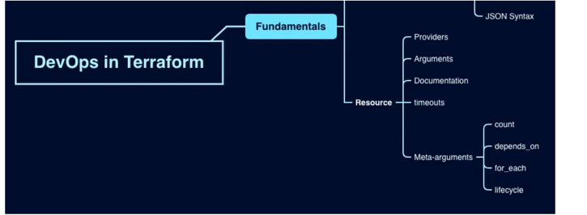

# References

https://blog.devgenius.io/terraform-basics-resource-b6e391e9ae86

## what is resource?

Resources are the most important part of the Terraform language as they describe infrastructure objects like virtual networks, compute instances, and even components like DNS records.

## Resource example

````
resource "aws_instance" "example" {
  ami           = "ami-0c55b159cbfafe1f0"
  instance_type = "t2.micro"
  tags = {
    Name = "example-instance"
  }
}

````

## Resoource types

````
providers
arguments
documentations
````

## Providers

Providers are plugins that enable Terraform to interact with various infrastructure services, APIs, and platforms.Terraform can automatically install most providers when initializing a working directory.

````
AWS provider:

provider "aws" {
  region = "us-west-2"
}

resource "aws_vpc" "example" {
  cidr_block = "10.0.0.0/16"
}
````
````
Azure provider:

provider "azurerm" {
  features {}
}

resource "azurerm_resource_group" "example" {
  name     = "example-resources"
  location = "West Europe"
}

resource "azurerm_virtual_network" "example" {
  name                = "example-network"
  address_space       = ["10.0.0.0/16"]
  location            = azurerm_resource_group.example.location
  resource_group_name = azurerm_resource_group.example.name
}
````

## Meta-arguments

meta-arguments are special arguments that provide additional functionality to resource blocks

````
Here are some examples of commonly used meta-arguments in Terraform:

count : specifies the number of resource instances to create based on a condition, such as the size of a list or the value of a variable.
depends_on : specifies dependencies between resources, indicating that one resource must be created or updated before another can be created or updated.
lifecycle : specifies lifecycle customizations for resources, such as preventing certain attributes from being destroyed or preventing a resource from being replaced under certain conditions.
provider : specifies the provider to use for a resource, allowing you to create resources on different cloud platforms or services.
module : specifies a reference to a module that defines one or more resources, allowing you to reuse and modularize your Terraform configurations.
for_each : Create multiple instances according to a map or a set of strings.
```

## Documentation
The documentation resource type is used to add documentation to your Terraform configuration. This is a meta-resource that provides a way to document your infrastructure code, describing its purpose and functionality, in a structured way.


````
resource "documentation" "example" {
content = <<EOF
# Example Terraform Configuration

    This Terraform configuration creates an EC2 instance and a security group for it.

    ## EC2 Instance

    The EC2 instance is created using the following attributes:

    * `ami`: the Amazon Machine Image ID
    * `instance_type`: the instance type
    * `subnet_id`: the ID of the subnet where the instance will be launched
    * `tags`: a map of tags to apply to the instance

    ## Security Group

    The security group is created with the following ingress rules:

    * allow TCP traffic on port 22 from any IP address
    * allow TCP traffic on all ports from any IP address within the same security group
EOF
}
````

````
resource "aws_instance" "example" {
ami           = "ami-0c55b159cbfafe1f0"
instance_type = "t2.micro"
subnet_id     = "${aws_subnet.example.id}"

# Set timeouts for resource creation and deletion
````
timeouts {
create = "30m"
delete = "15m"
}
}
````


# Conclusion

